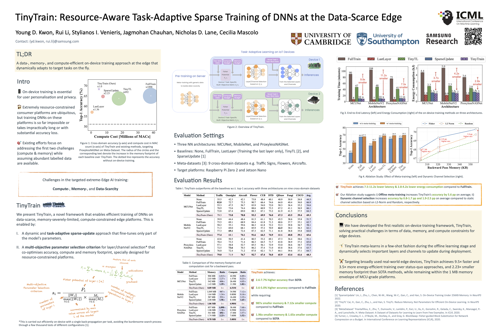
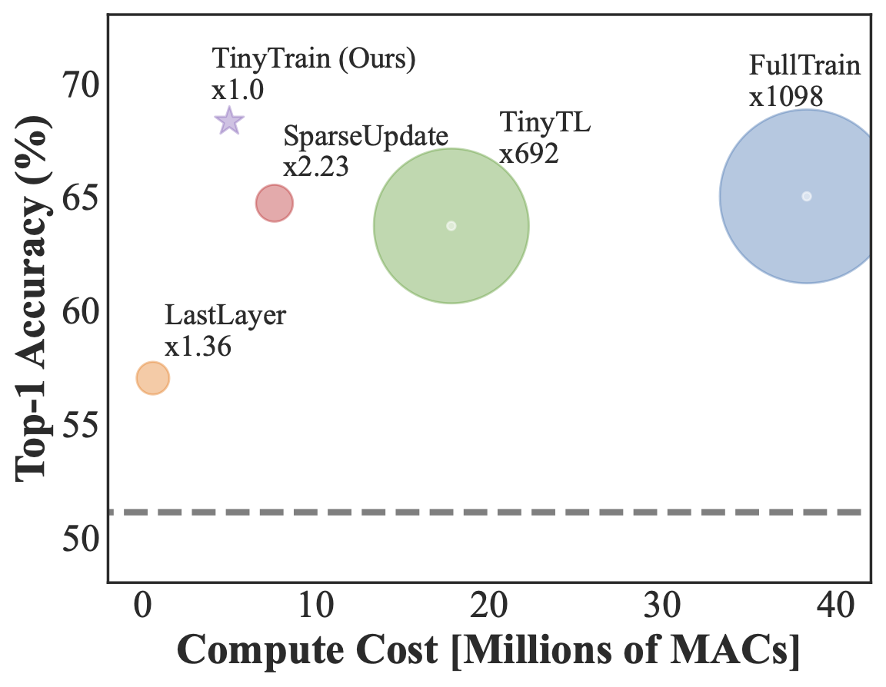

# TinyTrain: Resource-Aware Task-Adaptive Sparse Training of DNNs at the Data-Scarce Edge

# News 

[2 May 2024] Our paper is accepted to [ICML 2024](https://icml.cc/)!



# Overview

In this work, we present ***TinyTrain***, the first approach that fully enables compute-, memory-, and data-efficient on-device training on constrained edge devices. Compared to existing on-device training approaches, TinyTrain achieves the SOTA accuracy, with gains of 3.6-5.0% over fine-tuning the entire DNN (i.e., FullTrain). Also, TinyTrain significantly reduces the memory footprint and computation required for backward pass by up to 1,098× and 7.68×, respectively.

<p align="center">
  
</p>


## Results

### TinyTrain outperforms all the baselines w.r.t. top-1 accuracy with three architectures on nine cross-domain datasets


### Memory footprint and computation cost

<p align="center">
  
</p>

### End-to-end training time and energy consumption


## Citation
If you find our work useful in your research, please consider citing:
```
@inproceedings{kwon2024tinytrain,
    title     = {TinyTrain: Resource-Aware Task-Adaptive Sparse Training of DNNs at the Data-Scarce Edge},
    author    = {Kwon, Young D. and Li, Rui and Venieris, Stylianos I. and Chauhan, Jagmohan and Lane, Nicholas D. and Mascolo, Cecilia},
    booktitle = {International Conference on Machine Learning},
    year      = {2024}
}
```
